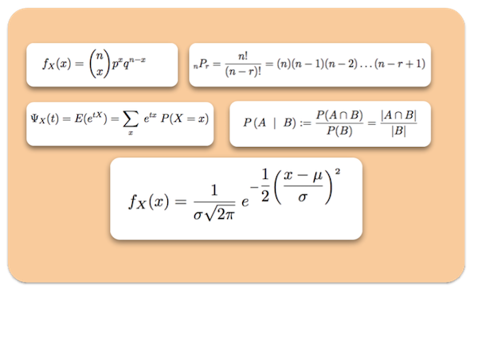

## ¿Qué es esto?

Hola... ¡Hey! Seguramente te estarás preguntando ¿Qué demonios estoy viendo?

Bueno, este pequeño texto intenta darle solución a esa pregunta, la respuesta mas inmediata es que este texto 
(o compilado como a nosotros nos gusta decirle) es una recopilación de teoremas, ideas y conceptos importantes que
aprendí a lo largo del tiempo sobre las bases de la Probabilidad y Estadística.

De manera regular estaremos actualizando estos textos con todo aquello nuevo que aprendamos intentando profundizar
en todos estos temas y cerrar posibles dudas en estas páginas.

Este Compilado intenta ser lo más estricto posible, aunque somos humanos y es posible (e incluso probable)
que cometamos pequeños errores de vez en cuando.

Espero que tomes estas páginas como un regalo, creado por seres imperfectos pero con muchos ánimos de hacer
del mundo un lugar mejor, ahora si, abróchate los cinturones que esto acaba de empezar.

## Contenidos

En este libro podrás aprender sobre los siguientes temas:

- **Notación**
	- Experimentos, espacios muestrales y eventos
- **Probabilidad**
	- Probabilidad básica
	- Propiedades
	- Probabilidad Condicional
- **Eventos Independientes**
	- Propiedades
	- Teorema de Bayes
- **Combinatoria**
	- Permutación
	- Combinación
	- Coheficientes Binomiales
- **Variables Aleatorias**
	- Función de Probabilidad
	- Función Acumulada
	- Esperanza
	- Varianza
	- Covarianza
	- Momentos
- **Distribuciones Famosas**
	- Bernoulli
	- Binomial
	- Geométrica
	- Hipergeométrica
	- Uniforme
	- Exponencial
	- Gamma
	- Normal
- **Hardcore**
	- Teorema Central del Límite
	- Teorema Central de Chebyshue
- **Probabilidad Conjunta**
	- Propiedades
	- Acumulada
	- Marginal
	- Condicional
	- Independencia de Variables
- **Estimadores Puntuales**
	- Insesgado
	- Varianza mínima
	- Optimo
	- Metodo de los Momentos
	- Metodo de Máxima Verosimilitud

  

## Sobre este Documento

### Ver el Documento en Línea o Descargarlo

Puedes descargar ambos archivos para tu disfrute o modificar del código fuente siguiendo las ideas del software libre.

### Autor

* [SoyOscarRH:  Oscar Andrés Rosas Hernandez](https://SoyOscarRH.github.io) 
 
	Estudiante de Sistemas Computacionales por la Escuela Superior de Cómputo en el Instituto Politécnico Nacional,
	estudiante de Ciencias de la Computación por la Facultad de Ciencias de la Universidad Autónoma de México, creador
	del proyecto CompilandoConocimiento.
	Aficionado a aprender y a enseñar lo poco que se sabe.

### Licencia

Este proyecto se encuentra bajo la licencia  GNU V2 License - puedes leerla en [LICENSE.md](LICENSE.md)

  
